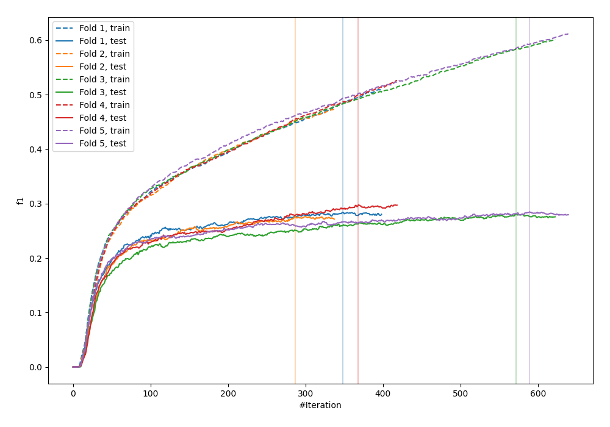
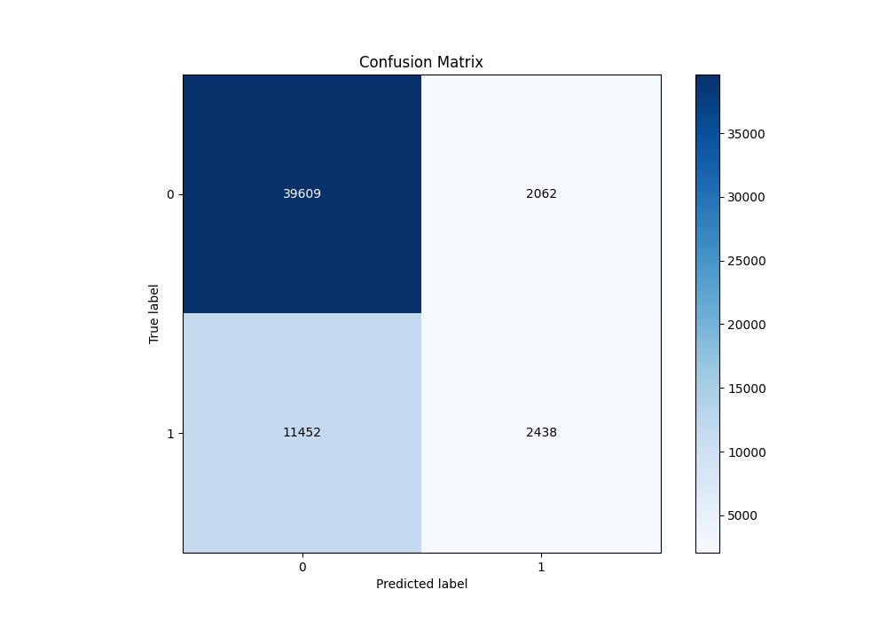
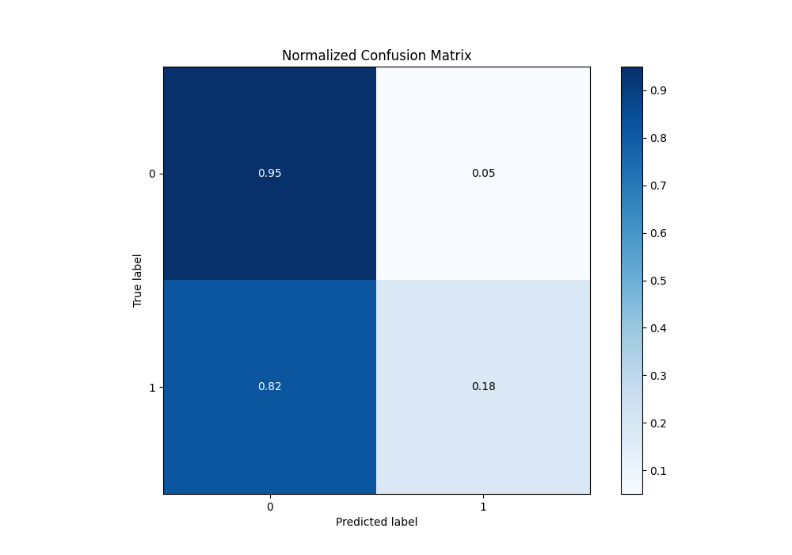
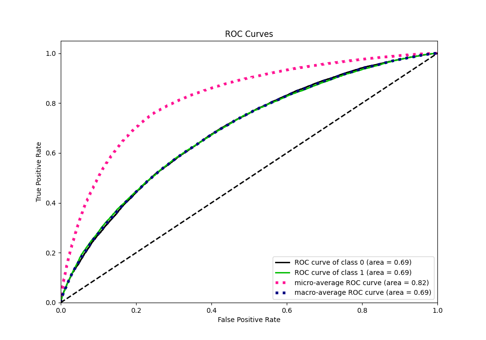
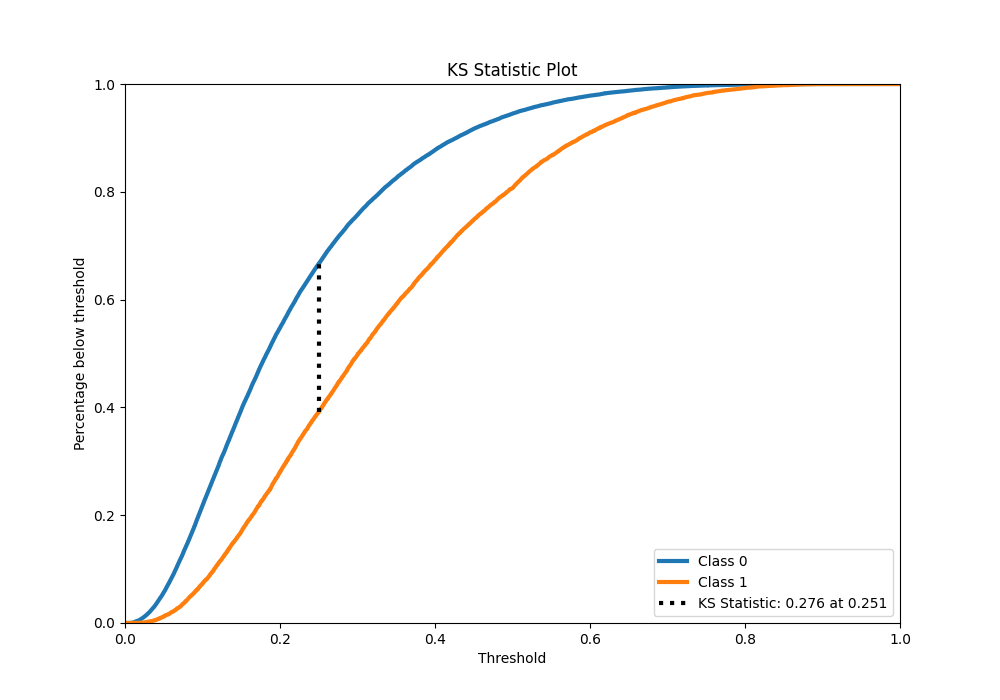
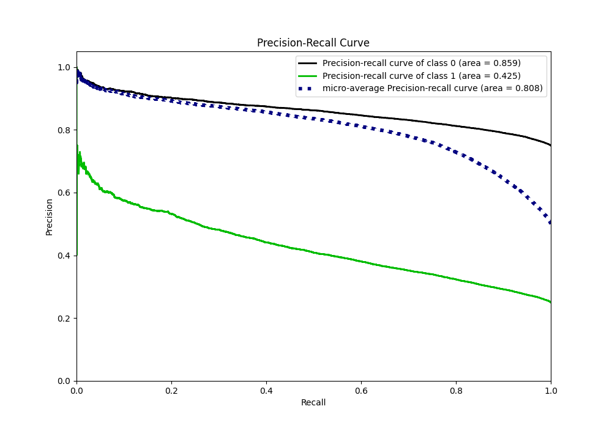
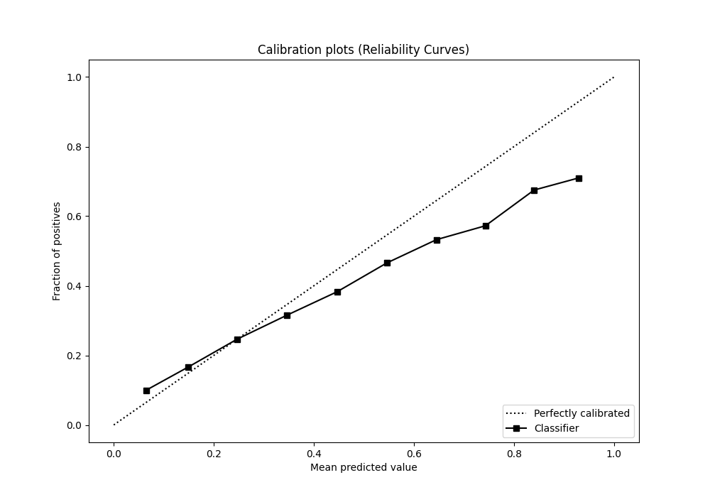
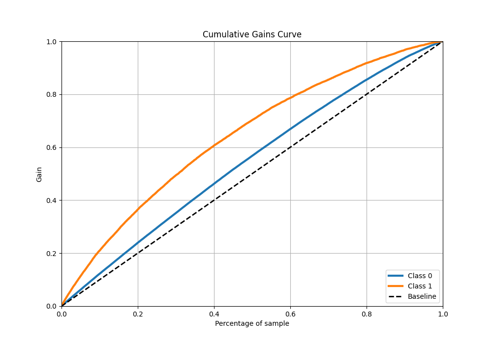
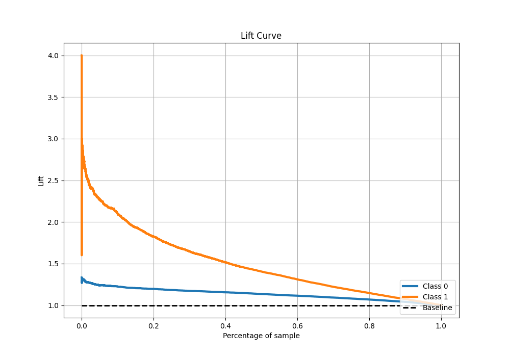

# Summary of 6_Xgboost

[<< Go back](../README.md)

## Extreme Gradient Boosting (Xgboost)
- **n_jobs**: -1
- **objective**: binary:logistic
- **eta**: 0.1
- **max_depth**: 7
- **min_child_weight**: 25
- **subsample**: 0.9
- **colsample_bytree**: 0.6
- **eval_metric**: f1
- **explain_level**: 0

## Validation
 - **validation_type**: kfold
 - **shuffle**: True
 - **stratify**: True
 - **k_folds**: 5

## Optimized metric
f1

## Training time

126.0 seconds

## Metric details
|           |    score |   threshold |
|:----------|---------:|------------:|
| logloss   | 0.522724 | nan         |
| auc       | 0.689522 | nan         |
| f1        | 0.46849  |   0.215184  |
| accuracy  | 0.756772 |   0.511508  |
| precision | 0.652033 |   0.711625  |
| recall    | 1        |   0.0043696 |
| mcc       | 0.245815 |   0.286464  |

## Metric details with threshold from accuracy metric
|           |    score |   threshold |
|:----------|---------:|------------:|
| logloss   | 0.522724 |  nan        |
| auc       | 0.689522 |  nan        |
| f1        | 0.265144 |    0.511508 |
| accuracy  | 0.756772 |    0.511508 |
| precision | 0.541778 |    0.511508 |
| recall    | 0.175522 |    0.511508 |
| mcc       | 0.200043 |    0.511508 |

## Confusion matrix (at threshold=0.511508)
|              |   Predicted as 0 |   Predicted as 1 |
|:-------------|-----------------:|-----------------:|
| Labeled as 0 |            39609 |             2062 |
| Labeled as 1 |            11452 |             2438 |

## Learning curves

## Confusion Matrix

## Normalized Confusion Matrix

## ROC Curve

## Kolmogorov-Smirnov Statistic

## Precision-Recall Curve

## Calibration Curve

## Cumulative Gains Curve

## Lift Curve

[<< Go back](../README.md)
