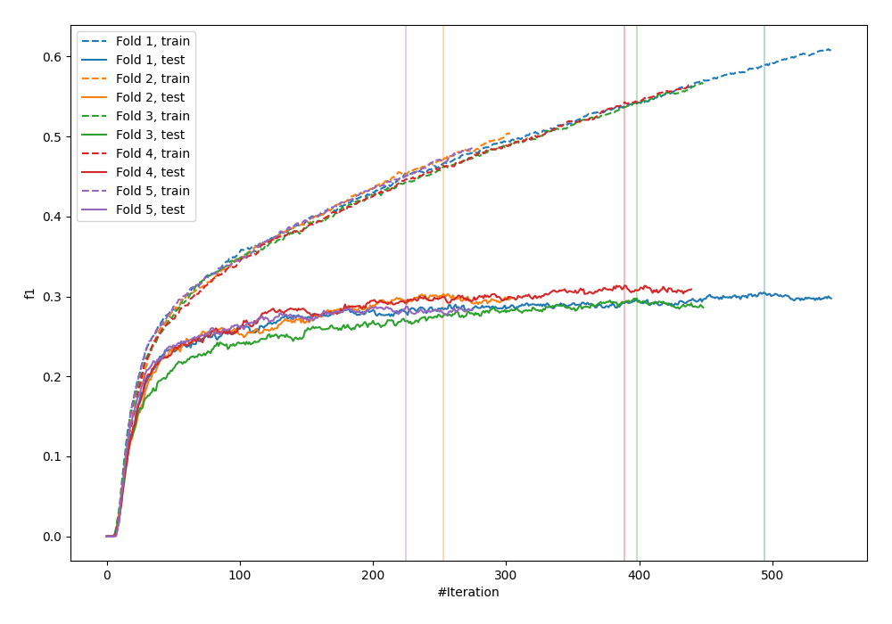
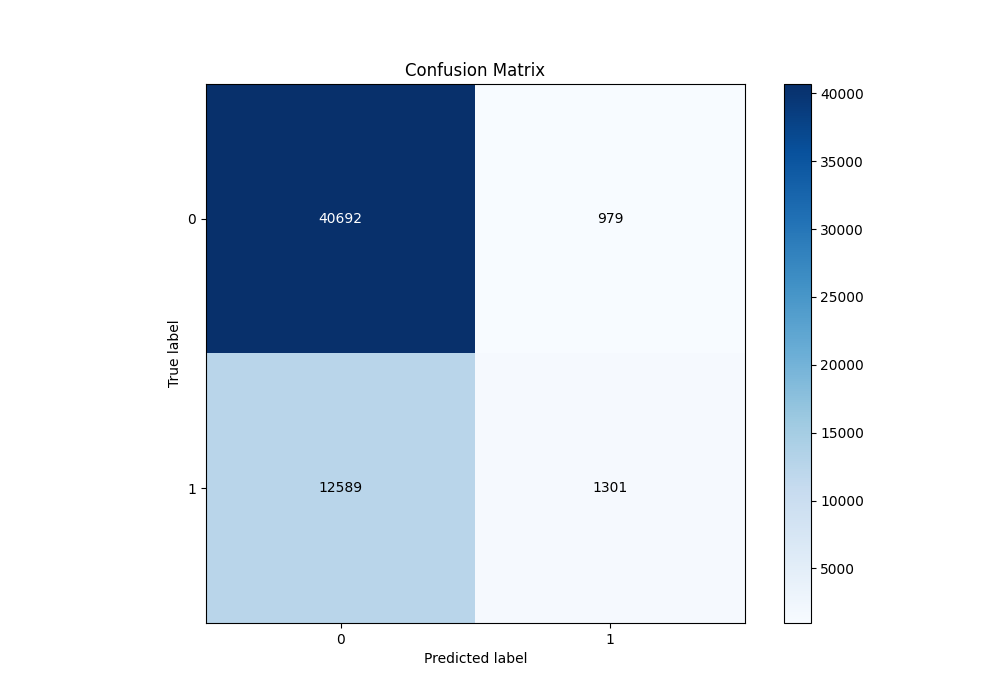
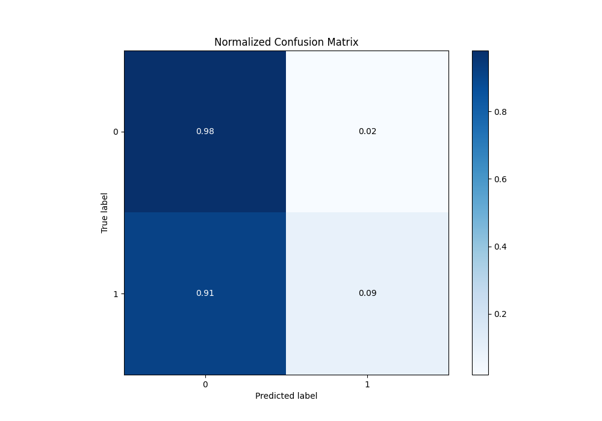
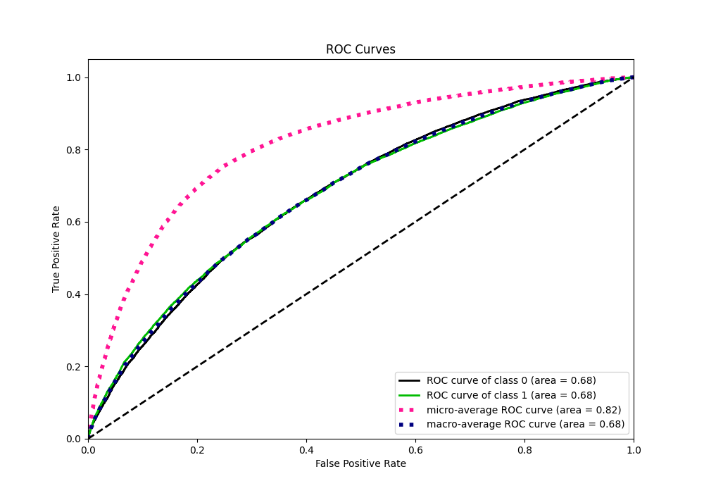
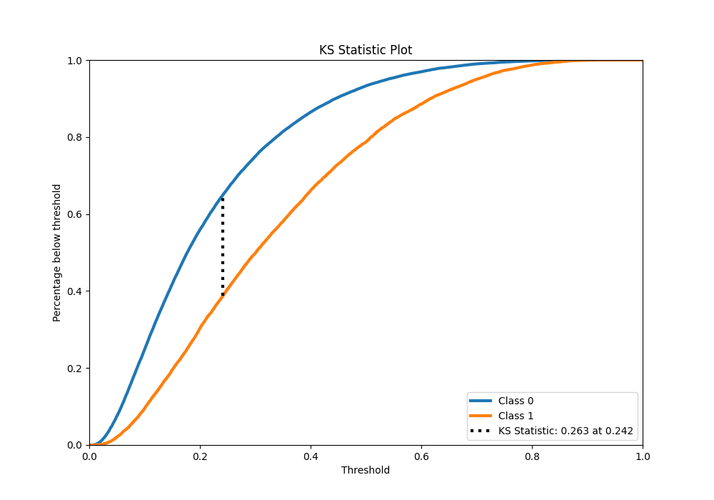
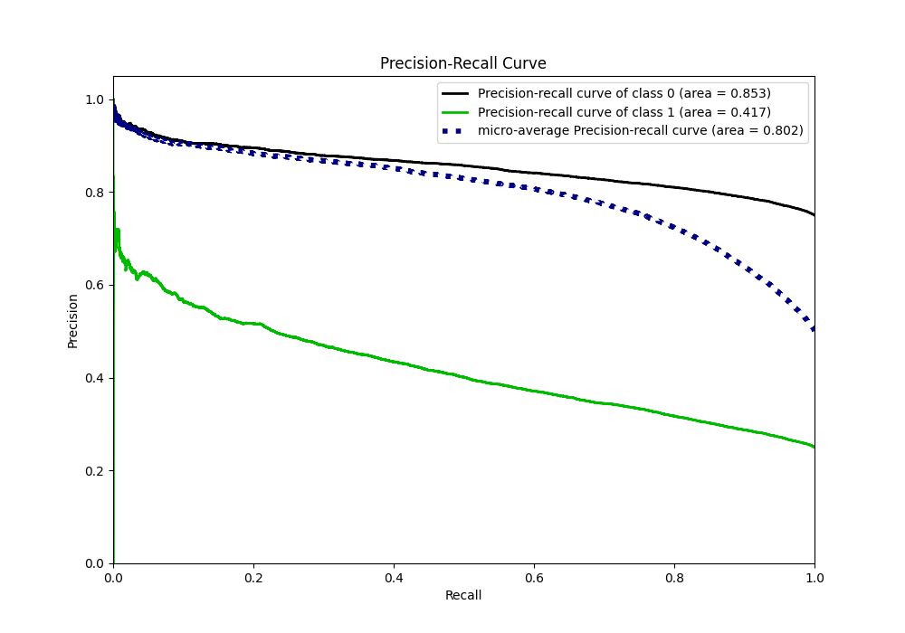
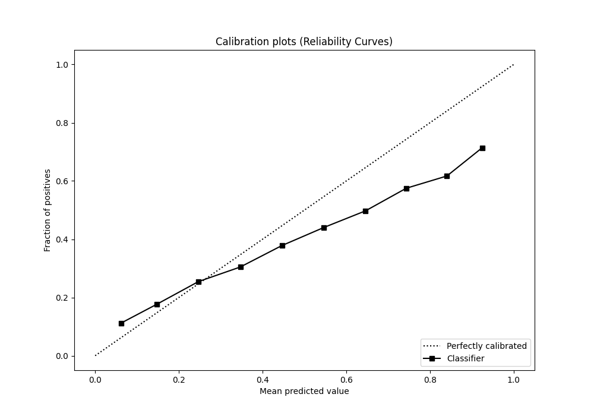
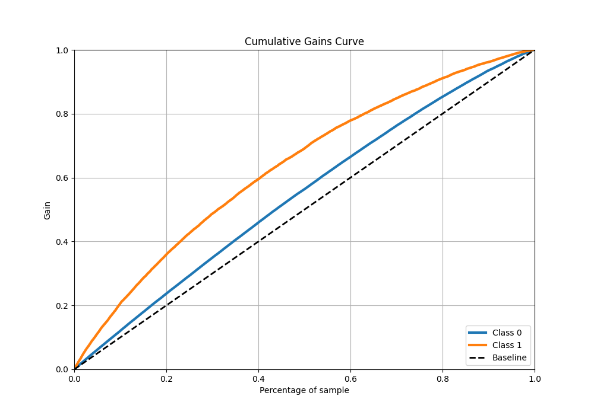
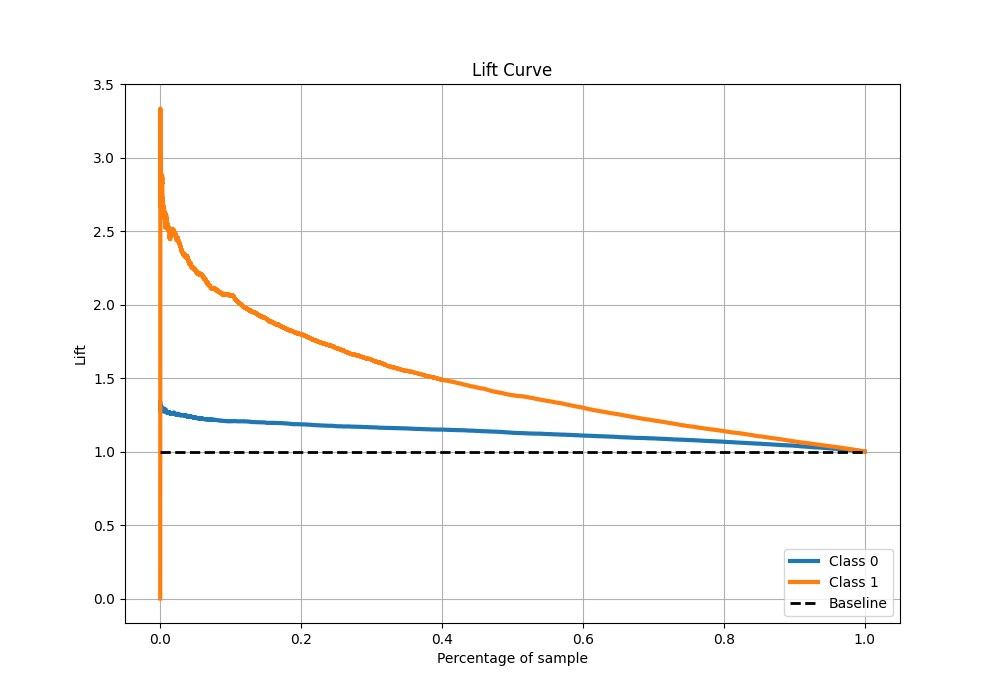

# Summary of 7_Xgboost

[<< Go back](../README.md)

## Extreme Gradient Boosting (Xgboost)
- **n_jobs**: -1
- **objective**: binary:logistic
- **eta**: 0.15
- **max_depth**: 8
- **min_child_weight**: 50
- **subsample**: 0.6
- **colsample_bytree**: 0.6
- **eval_metric**: f1
- **explain_level**: 0

## Validation
 - **validation_type**: kfold
 - **shuffle**: True
 - **stratify**: True
 - **k_folds**: 5

## Optimized metric
f1

## Training time

114.7 seconds

## Metric details
|           |    score |    threshold |
|:----------|---------:|-------------:|
| logloss   | 0.531755 | nan          |
| auc       | 0.680991 | nan          |
| f1        | 0.462883 |   0.193615   |
| accuracy  | 0.7558   |   0.625211   |
| precision | 0.629268 |   0.747438   |
| recall    | 1        |   0.00419584 |
| mcc       | 0.235712 |   0.307629   |

## Metric details with threshold from accuracy metric
|           |     score |   threshold |
|:----------|----------:|------------:|
| logloss   | 0.531755  |  nan        |
| auc       | 0.680991  |  nan        |
| f1        | 0.160915  |    0.625211 |
| accuracy  | 0.7558    |    0.625211 |
| precision | 0.570614  |    0.625211 |
| recall    | 0.0936645 |    0.625211 |
| mcc       | 0.153169  |    0.625211 |

## Confusion matrix (at threshold=0.625211)
|              |   Predicted as 0 |   Predicted as 1 |
|:-------------|-----------------:|-----------------:|
| Labeled as 0 |            40692 |              979 |
| Labeled as 1 |            12589 |             1301 |

## Learning curves

## Confusion Matrix

## Normalized Confusion Matrix

## ROC Curve

## Kolmogorov-Smirnov Statistic

## Precision-Recall Curve

## Calibration Curve

## Cumulative Gains Curve

## Lift Curve

[<< Go back](../README.md)
