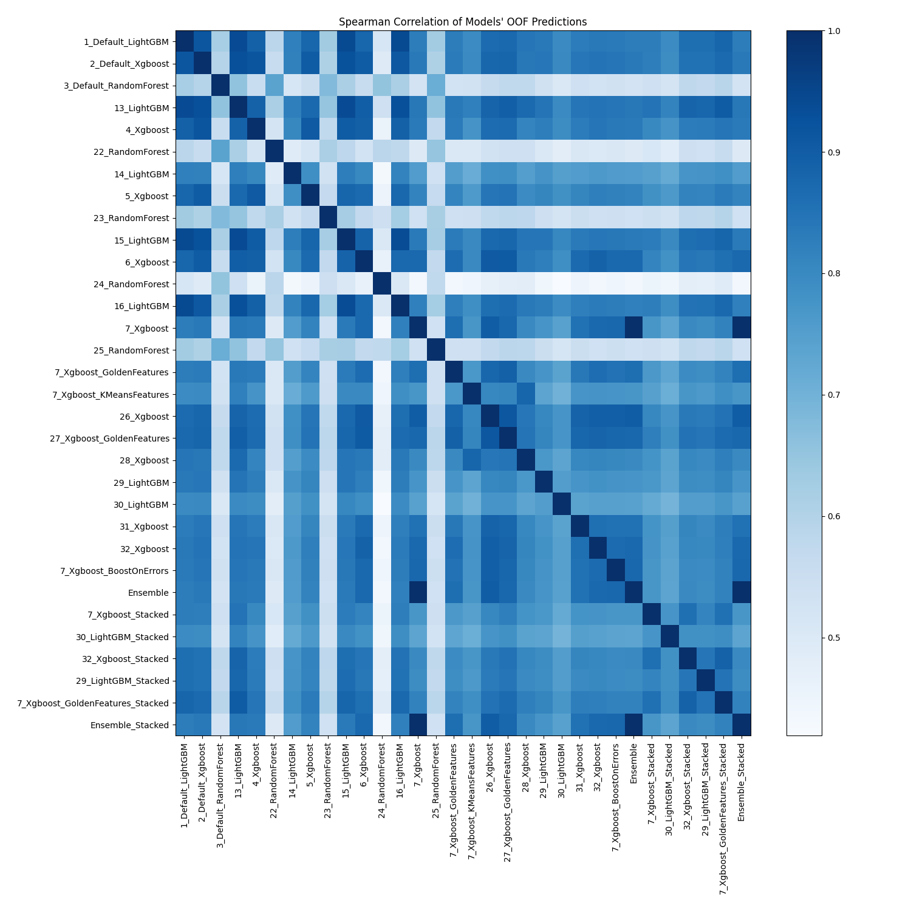

# AutoML Leaderboard

| Best model   | name                                                                           | model_type    | metric_type   |   metric_value |   train_time |
|:-------------|:-------------------------------------------------------------------------------|:--------------|:--------------|---------------:|-------------:|
|              | [1_Default_LightGBM](1_Default_LightGBM/README.md)                             | LightGBM      | f1            |      0.246689  |       135.46 |
|              | [2_Default_Xgboost](2_Default_Xgboost/README.md)                               | Xgboost       | f1            |      0.26885   |       123.18 |
|              | [3_Default_RandomForest](3_Default_RandomForest/README.md)                     | Random Forest | f1            |      0.0559242 |       131.76 |
|              | [13_LightGBM](13_LightGBM/README.md)                                           | LightGBM      | f1            |      0.238196  |       141.11 |
|              | [4_Xgboost](4_Xgboost/README.md)                                               | Xgboost       | f1            |      0.282839  |       132.85 |
|              | [22_RandomForest](22_RandomForest/README.md)                                   | Random Forest | f1            |      0.0577428 |        93.05 |
|              | [14_LightGBM](14_LightGBM/README.md)                                           | LightGBM      | f1            |      0.278336  |        87.64 |
|              | [5_Xgboost](5_Xgboost/README.md)                                               | Xgboost       | f1            |      0.273047  |       106.02 |
|              | [23_RandomForest](23_RandomForest/README.md)                                   | Random Forest | f1            |      0.136247  |       166.49 |
|              | [15_LightGBM](15_LightGBM/README.md)                                           | LightGBM      | f1            |      0.252011  |       122.16 |
|              | [6_Xgboost](6_Xgboost/README.md)                                               | Xgboost       | f1            |      0.284715  |       128.01 |
|              | [24_RandomForest](24_RandomForest/README.md)                                   | Random Forest | f1            |      0         |        99.48 |
|              | [16_LightGBM](16_LightGBM/README.md)                                           | LightGBM      | f1            |      0.247027  |       110.58 |
| **the best** | [7_Xgboost](7_Xgboost/README.md)                                               | Xgboost       | f1            |      0.30143   |       116.71 |
|              | [25_RandomForest](25_RandomForest/README.md)                                   | Random Forest | f1            |      0.100271  |       149.39 |
|              | [7_Xgboost_GoldenFeatures](7_Xgboost_GoldenFeatures/README.md)                 | Xgboost       | f1            |      0.296727  |       174.48 |
|              | [7_Xgboost_KMeansFeatures](7_Xgboost_KMeansFeatures/README.md)                 | Xgboost       | f1            |      0.286469  |       122.11 |
|              | [26_Xgboost](26_Xgboost/README.md)                                             | Xgboost       | f1            |      0.285187  |       119.13 |
|              | [27_Xgboost_GoldenFeatures](27_Xgboost_GoldenFeatures/README.md)               | Xgboost       | f1            |      0.282515  |       109.06 |
|              | [28_Xgboost](28_Xgboost/README.md)                                             | Xgboost       | f1            |      0.272313  |       126.15 |
|              | [29_LightGBM](29_LightGBM/README.md)                                           | LightGBM      | f1            |      0.280834  |       107.79 |
|              | [30_LightGBM](30_LightGBM/README.md)                                           | LightGBM      | f1            |      0.28292   |        89.11 |
|              | [31_Xgboost](31_Xgboost/README.md)                                             | Xgboost       | f1            |      0.29394   |       103.05 |
|              | [32_Xgboost](32_Xgboost/README.md)                                             | Xgboost       | f1            |      0.298967  |       114.15 |
|              | [7_Xgboost_BoostOnErrors](7_Xgboost_BoostOnErrors/README.md)                   | Xgboost       | f1            |      0.29528   |       102.22 |
|              | [Ensemble](Ensemble/README.md)                                                 | Ensemble      | f1            |      0.30143   |        21.36 |
|              | [7_Xgboost_Stacked](7_Xgboost_Stacked/README.md)                               | Xgboost       | f1            |      0.277919  |        94.29 |
|              | [30_LightGBM_Stacked](30_LightGBM_Stacked/README.md)                           | LightGBM      | f1            |      0.278882  |        86.95 |
|              | [32_Xgboost_Stacked](32_Xgboost_Stacked/README.md)                             | Xgboost       | f1            |      0.270865  |        78.93 |
|              | [29_LightGBM_Stacked](29_LightGBM_Stacked/README.md)                           | LightGBM      | f1            |      0.261071  |        75.69 |
|              | [7_Xgboost_GoldenFeatures_Stacked](7_Xgboost_GoldenFeatures_Stacked/README.md) | Xgboost       | f1            |      0.264382  |        70.01 |
|              | [Ensemble_Stacked](Ensemble_Stacked/README.md)                                 | Ensemble      | f1            |      0.30143   |        25.86 |

### AutoML Performance

### AutoML Performance Boxplot

### Spearman Correlation of Models

